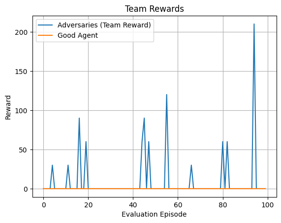
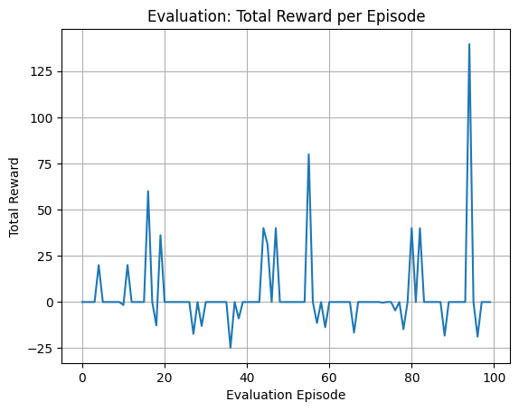
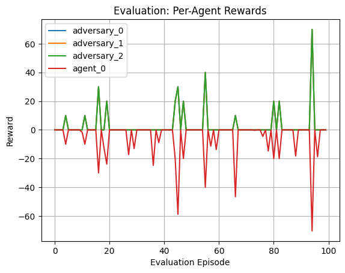

# Multi-Agent Actor-Critic for Mixed Cooperative-Competitive Environments
Implementation of [Multi-Agent Actor-Critic for Mixed Cooperative-Competitive Environments](https://arxiv.org/abs/1706.02275) paper.
## Implementation

At first, we define 3 predators, 1 prey, 2 obstacles, and a maximum of 25 environment steps per episode. We define the number of episodes as 2000, set $\gamma = 0.95$, and use a learning rate of $10^{-3}$. Furthermore, we define the Actor and Critic neural networks, the ReplayBuffer, and the soft-update mechanism.

We then proceed to define the training loop. First, we reset the environment. For every agent, an action is selected, after which the environment advances to the next state. The resulting information is stored in the corresponding replay buffers. During training, the Critic and Actor networks are updated, followed by the soft-update of the target networks.

After completing the training loop, we implement the evaluation loop, where each agent selects its actions deterministically and the environment is updated accordingly.

## Evaluation

From the visualizations, we can observe that the prey is consistently able to escape the predators. Although the adversarial agents appear to coordinate effectively, the limited number of environment steps prevents them from successfully catching the prey. Nevertheless, the predators demonstrate that they are able to learn and improve their behavior during training.

### Team Rewards

### Total Rewards per Episode

### Rewards per Agent

